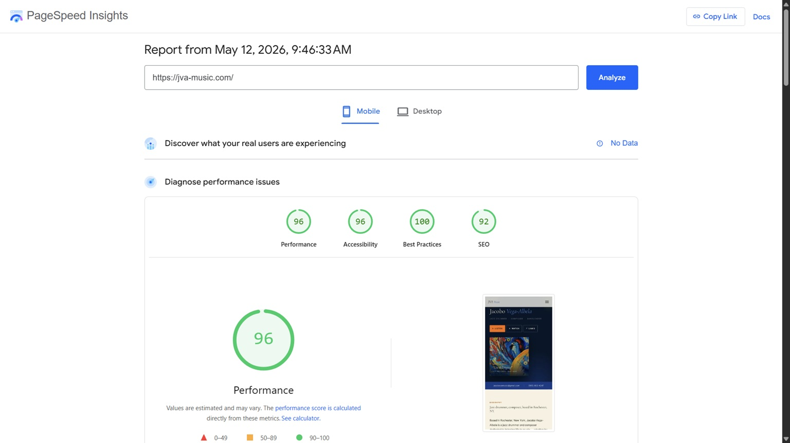
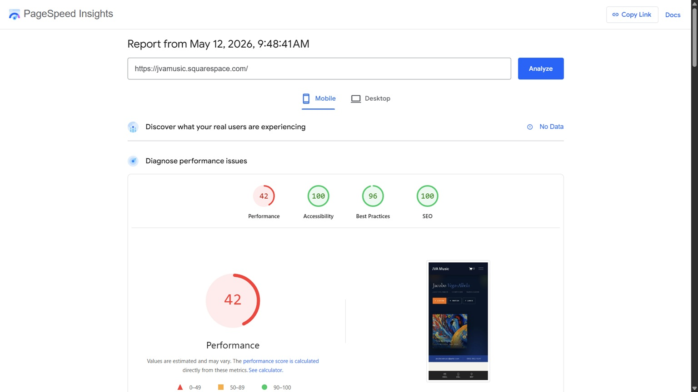
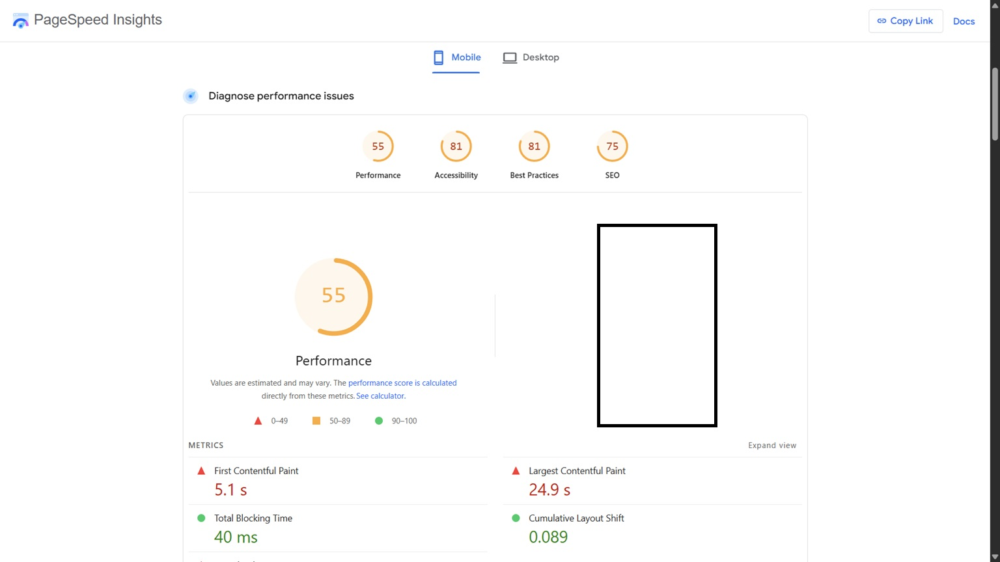

**The site has to do a lot of jobs.** It's a press kit for a debut album. It's a booking page for a touring artist. It's a sales funnel for a private drum-teaching practice. And it's the local-search presence Google needs to surface when someone searches "drum lessons Rochester."

Squarespace could have done most of this, but only with a stack of code injections, the premium subscription tier required to enable them, and a site that still felt off-brand underneath. Astro did all of it cleanly, plus things no template could support at all, like a working metronome page baked right into the site.

## What's on the site

- **Album section** with track-by-track notes, personnel, press coverage, and radio airplay across five stations.
- **Drum lessons** and **group classes** pages with structured content local SEO can chew on (location, service area, lesson formats).
- **Blog** for ongoing content, **PDFs** for educational material.
- **A custom metronome** built into the site. The kind of thing template platforms can't do without an iframe hack.

## Under the hood

- Static Astro build, deployed straight to a CDN. Sub-second page loads.
- Full social meta on every page: Open Graph, Twitter cards, canonical URLs, properly sized and alt-texted album art. Release posts share cleanly across platforms.
- Inter font self-hosted and preloaded. No layout shift, no third-party font CDN.
- Mobile-first and accessible. Vanilla JS where it's needed (the metronome page, interactive forms, navigation), but no React or Vue runtime adding 100kB to every page.

## What the numbers say

Three PageSpeed Insights mobile scores, run cold on the same morning:

| Site | Mobile Performance |
|---|---|
| **jva-music.com** (this site, Astro) | **96** |
| jvamusic.squarespace.com (the old build) | 42 |
| A well-resourced local music-education competitor | 55 |

Same content, same audience, same scoring tool. The Astro build scores **more than 2× the old Squarespace version**, and beats a much larger local competitor by **41 points**. The drum-lessons page is even more lopsided: **96 on Astro vs. 26 on Squarespace**. The bigger competitor's hero image takes nearly **25 seconds** to render on mobile.

These scores are built on Core Web Vitals, the page-speed signals Google uses to rank search results. Slower page → lower rank → fewer customers walking through the door.

This is what one person with the right tools can do: beating a Squarespace template by 54 points and a well-resourced local competitor by 41.

## Why I'm using this as my first case study

This is the site I built when I was still a frustrated small-business owner trying to outrank generic competitors on Google. Everything Squarespace couldn't do, I fixed here. Everything I now sell at JVA/dev (local SEO, image optimization, clean static builds) I learned by working through this site first.

If you want to know what I can actually build, start here.
